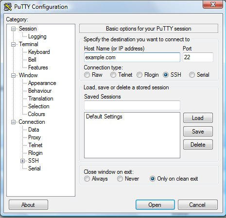
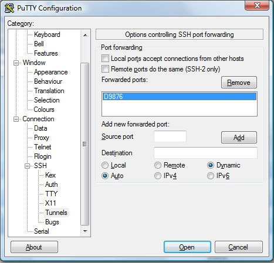
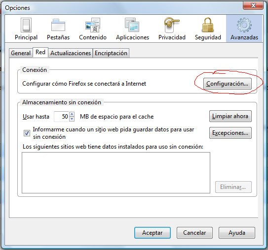
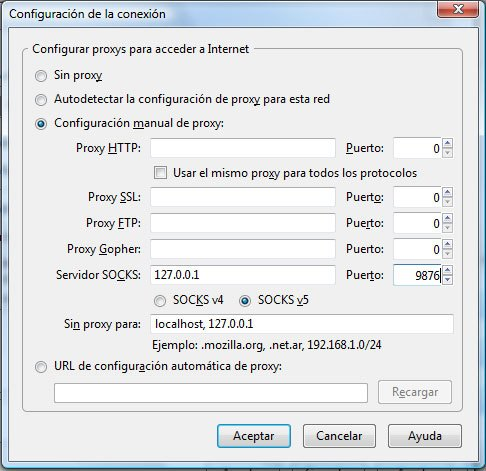

Bienvenidos a una entrega de &#34;Como pasarse las restricciones de la empresa por el arco del triunfo&#34;. Si hay una cosa que me moleste mucho es que me restrinjan cosas en la PC, y aún mas que me bloqueen sitios (o peor aún, palabras en la URL), ya que como soy de buscar mucho, de repente al encontrar algún artículo que me parece interesante me topo con una pantalla con un simpático mensaje: &#34;_**Access Denied:** Access control configuration prevents your request from being allowed at this time. Please contact your service provider if you feel this is incorrect._&#34; Agh, me dan ganas de tirar la PC por la ventana.

En fin, a lo que venía. Este fin de semana estuve leyendo sobre los [túneles SSH](http://marcoalfonso.net/2008/12/24/tuneles-ssh/), y que una de sus utilidades podía ser para pasar por encima de algún firewall que tengamos instalado, por lo que mientras lo leía me surgió la idea de intentarlo en la oficina (¡¿cómo puede ser que nos bloqueen twitter?! xD). Así que aquí vamos:

### Ingredientes

1. [Putty](http://www.chiark.greenend.org.uk/~sgtatham/putty/download.html)

2. Algún navegador web (en este ejemplo usaremos [Firefox](http://www.mozilla.com/en-US/firefox/))
3. Cuenta SSH en algun servidor

### Instrucciones

1. Abrimos Putty y en la sección de _Session_ configuramos los datos de nuestro servidor donde tenemos la cuenta SSH:

    

    Ahora vamos a la sección de _Connection - SSH - Tunnels_ y lo configuramos de la siguiente manera:

    **Source port** escribe cualquiera, en este ejemplo usaremos 9876

    **Destination** déjalo en blanco Selecciona las opciones de _Dynamic_ y _Auto_ Da click al botón de _Add_

    

2. Damos click al botón de **_Open_**

3. Nos va a conectar a nuestro servidor donde debemos loguearnos usando nuestro usuario y contraseña. Cuando hayas hecho esto, es todo con putty, solo mantén abierta la sesión.

4. Ahora nos vamos a nuestro navegador, en este caso será Firefox. Vayamos a la pestaña de \_Herramientas\_ y de ahí al submenú de _Opciones_. En la pestaña _Avanzadas_, subpestaña _Red_, bajo la sección de _Conexión_ damos click al botón de _Configuración..._

    

5. Llenamos los datos como en la siguiente pantalla: En _Servidor SOCKS_ ponemos la ip 127.0.0.1 y al lado en el puerto ponemos el que hayamos usado al configurar Putty, en este caso el 9876.

    

6. Damos click a Aceptar y guardamos todos los cambios. Y ahora la prueba de fuego: trata de entrar a cualquier sitio (yo me fui directo por un sitio bloqueado, Twitter) y si todo salío bien, entonces no deberías tener problemas para entrar al sitio :)

### Conclusiones

Y si amigos, eso es todo. En si este pequeño How-to es una traducción de lo que pueden encontrar en [http://www.devdaily.com/unix/edu/putty-ssh-tunnel-firefox-socks-proxy/index.shtml](http://www.devdaily.com/unix/edu/putty-ssh-tunnel-firefox-socks-proxy/index.shtml), y se me ocurrió ponerlo aquí como recordatorio para mi y por si a alguien mas le sirve. ¡Saludos!

### Notas

Cabe mencionar que si el navegador que usas es Firefox, hay otro detalle a tener en cuenta. El tráfico web va a pasar a través de el túnel, sin embargo las peticiones DNS van a pasar por tu red local, por lo que podrán seguir monitoreando los sitios que visitas. Para cambiar esto escribe **about:config** en la barra de direcciones y cambia el valor de configuracion **network.proxy.socks_remote_dns** a **true**.
